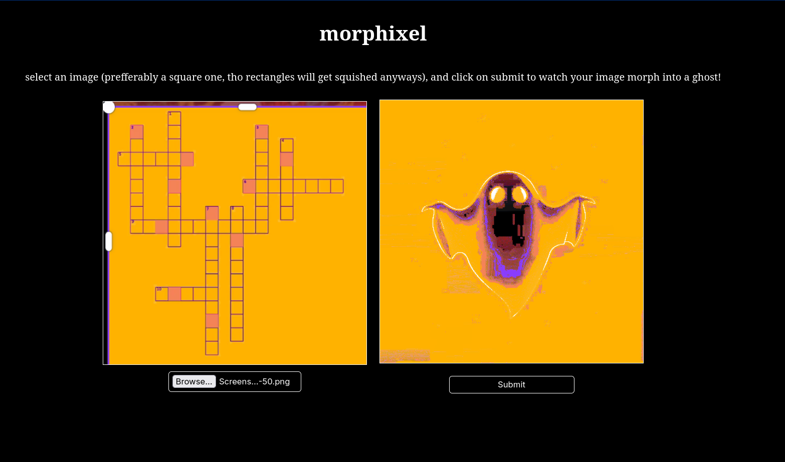

# morphixel

### desciption
a tool to morph your images into a ghost! it uses the canvas element to manipulate the coordinates of individual pixels, and turns them into an image of a ghost (actually any image you like!) 

### how its built
built using vanilla html css and js... uses the canvas element to get the rgba data of each pixel in an array. then a multiplier gives it a brightness value, and the whole array is then sorted by the brightness of the pixels; the rgba, brightness and location of the pixel is stored. This is done both for the input and output images. then the arrays are matched, and then the input pixel corresponding to the brightness of the output pixel is moved to the location of that output pixel...

### how to use
just head over to [here](https://shlokdee.github.io/morphixel), upload an image, and click submit. ideally use a square image, but it squishes the rectangles into a square anyway. 
if you want to use other images as the final output, clone the repo and change the output.jpg, and serve using a basic vscode live or python server

### inspiration
i saw a bunch of videos doing the same thing, the first video i saw like this was a person converting everything into obama lol. i wanted to do the same on my own...